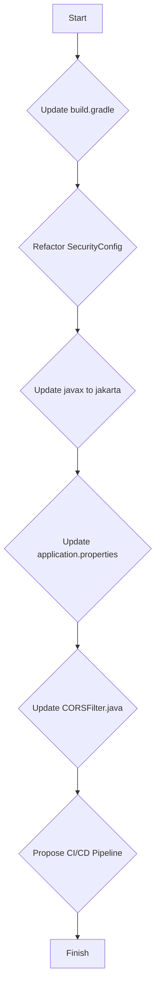

# Enhancement Plan: Upgrade to Java 17 and Spring Boot 3

This plan outlines the steps required to upgrade the project from Java 8 and Spring Boot 1.4.3 to Java 17 and Spring Boot 3.x.x.

## 1. Update `build.gradle`

*   **Update Spring Boot Plugin:**
    *   Change `springBootVersion` to a modern Spring Boot 3.x.x version (e.g., `3.1.5`).
    *   Update the `classpath` to use the new plugin.
*   **Update Java Version:**
    *   Set `sourceCompatibility` and `targetCompatibility` to `17`.
*   **Update Dependencies:**
    *   Update all `org.springframework.boot` dependencies to the new version.
    *   Update `mysql-connector-java` to a compatible version.
    *   Update `flyway-core` to a version that supports Spring Boot 3.
*   **Add `flyway-mysql` dependency:**
    *   Spring Boot 3 requires a separate Flyway dependency for each database type.

## 2. Refactor Security Configuration (`SecurityConfig.java`)

*   **Remove `WebSecurityConfigurerAdapter`:**
    *   The class should no longer extend `WebSecurityConfigurerAdapter`.
*   **Create `SecurityFilterChain` Bean:**
    *   Create a `SecurityFilterChain` bean to configure `HttpSecurity`.
    *   Replace `antMatchers` with `requestMatchers`.
    *   The `httpBasic` configuration will need to be updated.
    *   The session management policy will remain `STATELESS`.
*   **Update `UserDetailsService`:**
    *   The `userDetailsServiceBean` method should be removed. Instead, a `UserDetailsService` bean should be defined.
*   **Update `DaoAuthenticationProvider`:**
    *   The `authProvider` bean will need to be updated to use the new `UserDetailsService` bean.

## 3. Update `javax` to `jakarta` Namespace

*   **JPA Entities:**
    *   In all model classes (e.g., `Category.java`, `Customer.java`), change `javax.persistence.*` imports to `jakarta.persistence.*`.
*   **Servlet API:**
    *   In `CORSFilter.java` and `CustomBasicAuthenticationEntryPoint.java`, change `javax.servlet.*` imports to `jakarta.servlet.*`.

## 4. Update `application.properties`

*   **Update Datasource Properties:**
    *   The `spring.datasource.data-username` and `spring.datasource.data-password` properties are deprecated. These should be removed.

## 5. Update `CORSFilter.java`

*   **Replace `javax.servlet` with `jakarta.servlet`:**
    *   Update all imports to use the `jakarta.servlet` package.
*   **Add `@Component` annotation:**
    *   The filter should be annotated with `@Component` to be picked up by Spring's component scanning.

## 6. Propose a CI/CD pipeline for automated builds and deployments

*   **Create a `.github/workflows/build.yml` file:**
    *   This file will contain a basic GitHub Actions workflow to build the project.

Here is a Mermaid diagram illustrating the proposed changes:

